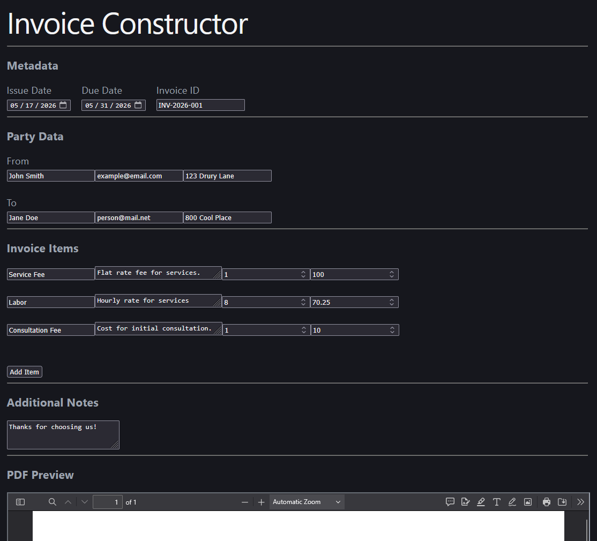

# Invoice Constructor

Quickly create simple invoices, and export them to PDF.


  
  
  


## Features


Easily add data to create automatically formatted invoices.


- Set information about the sending and receiving parties.
- Add details such as invoice ID, issue date, and due date.
- Create a variable number of invoice items with full features.
- Automatically calculate running totals.
- Preview and download the final PDF from the browser.


An example invoice that was generated by this website can be found [here.](README/example-invoice.pdf)




**Browser view of the Invoice Constructor**

## How to Run


To run the project locally, npm and vite must be installed. Then, to locally host the website, use:

```
npm run dev
```